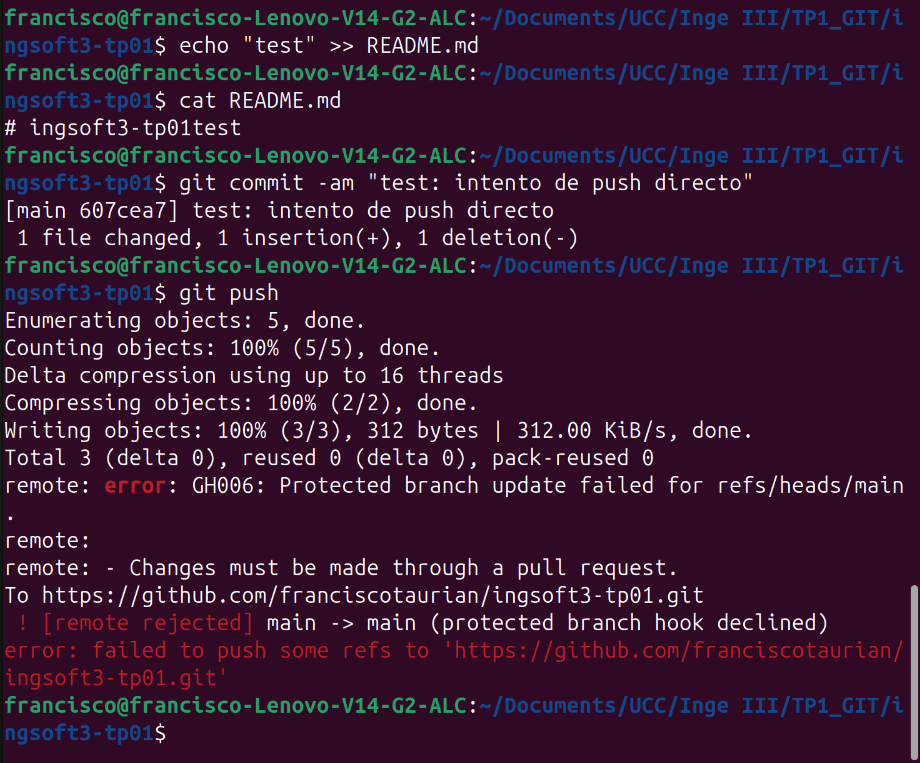
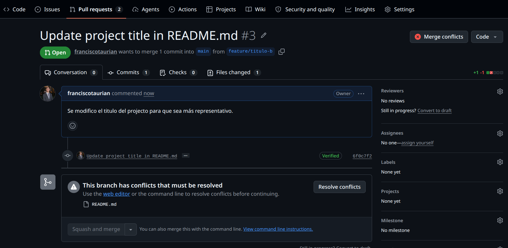
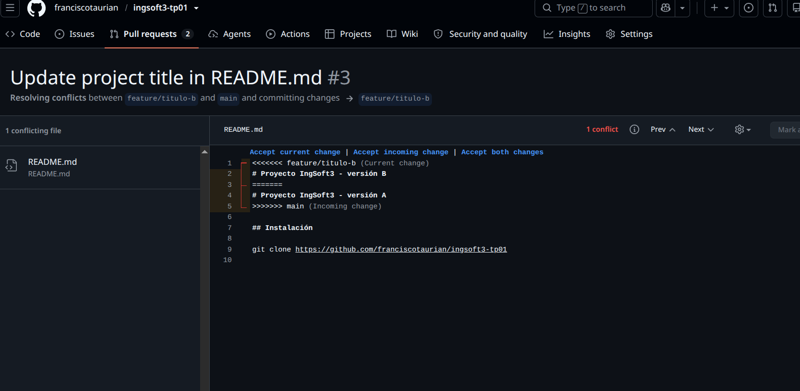
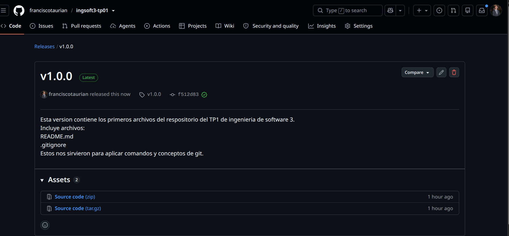
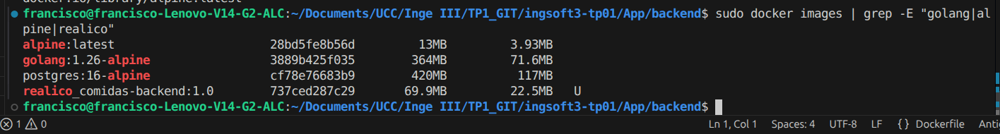
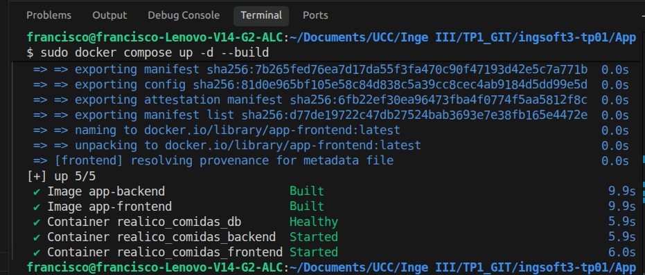
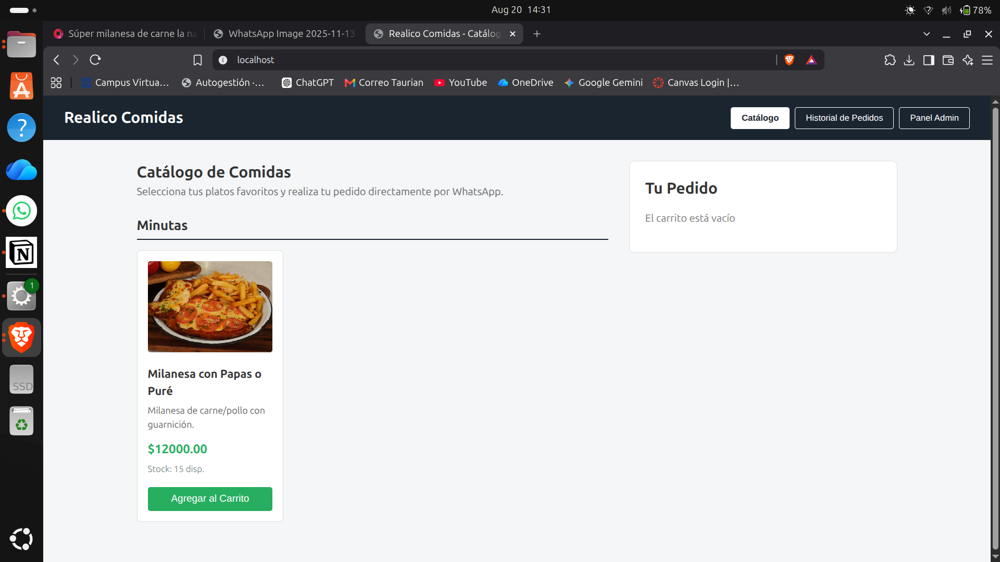
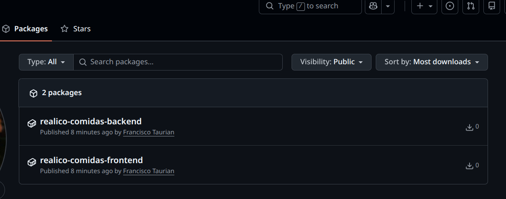

# Evidencias — TP1

## 1. Push directo a main rechazado

GitHub rechaza el push porque main está protegida y la regla alcanza también al dueño del repo.

## 2. El PR de la rama B no se puede mergear: conflicto

No nos permite hacer el merge directo con Main ya que detecto un conflicto. Una misma linea fue modificada en dos ramas distintas, la primera rama ya hizo merge y ahora git no sabe si mantenerla o no.

## 3. Lineas que generan el conflicto en el PR

Nos permite decidir sobre el codigo, cuales lineas mantener mostrandonos cuales son las lineas conflictivas.

## 4. Release publicada con los cambios realizados

Release publicada con el comentario que describe lo que incluye la version.

# Evidencias tp2

## 1. Diferencias tamaño de imagenes

## 2. Docker compose up

## 3. Persistencia de datos

## 4. Imagenes publicadas

